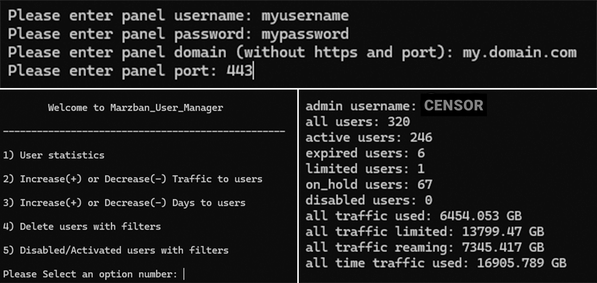

<p align="center">
	<a href="./README-fa.md">
	فارسی
	</a>
</p>

# Script Introduction

This script is developed to facilitate your work with Marzban panel and manage your users. It provides the following features:

- Ability to increase/decrease users' traffic (in percentage or numeric values).
- Ability to increase/decrease users' time (in numeric values).
- Ability to deactivate/activate users in bulk.
- Ability to delete users with custom filters in bulk.
- Ability to get comprehensive user information with custom filters (number of users, user statuses, total usage, limit, lifetime usage).

All these features can be applied to the following categories:

- All users
- Users of a specific admin
- Users with a specific username prefix

# How to Use the Script

### Required Information

- **Panel Username:** Enter the username of your sudo admin panel.
- **Panel Password:** Enter the password of your sudo admin panel.
- **Panel Domain:** Enter your panel domain according to the pattern (sub.domain.com).
- **Panel Port:** Enter your panel's login port.
- **Panel SSL:** Enter 'y' if have ssl else enter 'n'.

### Linux (Recommended)

Enter the following command to automatically install and run the script.
```bash
sudo bash -c "$(curl -sL https://github.com/M03ED/Marzban_User_Manager/raw/main/install.sh)"
```

## Windows
1. Download Project And Extract It 
2. Install Python +3.10
3. Open cmd
4. Run These Commands
```
curl https://bootstrap.pypa.io/get-pip.py -o get-pip.py
python get-pip.py
pip install -r requirements.txt
```
Now You Can Run Script With This Command
```
python main.py
```
# Contributors
If You See A Bug Or You Have Idea To Make Script Better You Can Make Pull Request And Commit The Changes


